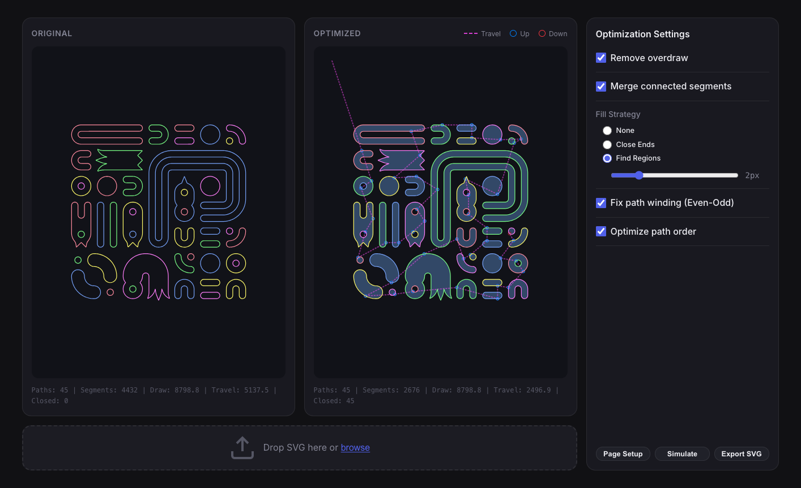

# Watertight SVG

**A high-performance geometric optimizer for SVG paths, designed for plotters, laser cutters, and CNC machines.**

Watertight SVG takes messy, disconnected, or overdrawn vector graphics and turns them into clean, continuous paths optimized for physical drawing machines. It solves common issues like "double-drawing" (overdraw), erratic travel movements, and disconnected segments.



## Features

### 🔧 Geometry Cleanup
- **Remove Overdraw**: Eliminates duplicate segments (overlapping lines), preventing pens from drawing the same line twice and tearing paper.
- **Merge Paths**: intelligently joins connected segments into long, continuous paths to reduce pen-up/down movements.
- **Split at Intersections**: Explicitly creates vertices where paths cross, ensuring correct topology for filling and region finding.
- **Colinear Simplification**: Merges adjacent segments that lie on the same line, reducing file size and machine instruction count.

### 🧠 Smart Optimization
- **Path Sorting (TSP)**: Uses a Traveling Salesperson Problem (TSP) approximation (2-Opt) to minimize air travel distance between cuts/draws.
- **Region Finding**: Identifies enclosed regions from unclosed stroke data—perfect for converting "line art" into "filled shapes" for hatching or vinyl cutting.
- **Winding Correction**: Automatically fixes path direction (clockwise/counter-clockwise) for correct "fill" interpretation by browsers and machines.

### 🚀 High Performance
- **Local-First**: Runs entirely in your browser using a Web Worker. No data is sent to any server.
- **Spatial Indexing**: Uses Quadtrees for O(n log n) intersection detection instead of brute force.
- **Robust Math**: Handles epsilon-length segments and floating-point logic to ensure "watertight" loop closure.
- **Simulator**: Built-in 2D plotter simulator to verify the drawing order and physical output before sending to a machine.

### 📐 Page Setup & Export
- **Custom Units**: Switch seamlessly between Millimeters and Inches.
- **Scale to Fit**: Automatically scale your design to fit any custom paper size.
- **Rotation**: Rotate output 90° for optimal paper usage.
- **Simulator**: Visual playback of the plot job, including travel moves and pen-up/down events.

## Usage

1. **Drag & Drop** an SVG file onto the drop zone.
2. Adjust settings in the panel:
   - **Remove Overdraw**: Essential for cleaning up exported CAD/Illustrator files.
   - **Merge Connected Segments**: Drastically reduces plot time.
   - **Find Regions**: strictly for when you need to detect closed shapes from line soup.
4. Click **Page Setup** to define your paper size, units (mm/in), and scaling options.
5. Click **Simulate** to watch a virtual plotter draw your design, ensuring the order is correct.
6. Click **Download Optimized** to save the clean SVG.

## Local Development

This project uses [Vite](https://vitejs.dev/) and TypeScript.

```bash
# Install dependencies
npm install

# Start development server
npm run dev

# Build for production
npm run build
```

## Architecture

The optimization pipeline runs in a Web Worker to keep the UI responsive. The core pipeline steps are:

1. **Parser**: Converts SVG string to a geometric segment model.
2. **Intersection Split**: Breaks all crossing segments to create explicit nodes.
3. **Overdraw Pruning**: Removes geometrically identical segments (checking both directions).
4. **Merge**: Iteratively joins segments with touching endpoints into chains.
5. **Region Finding (Optional)**: Uses graph traversal to find minimum cycle basis (closed loops).
6. **Sorting**: Reorders final paths to minimize pen-up travel distance.
7. **Builder**: Reconstructs valid SVG path data strings.

## License

MIT © 2024
